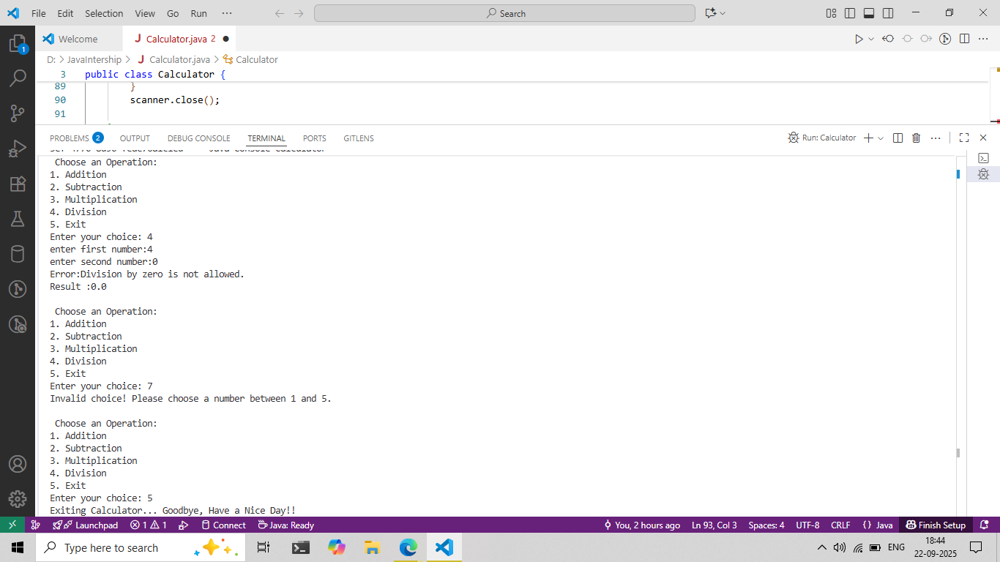

# Java Console Calculator

A simple Java console-based calculator that performs basic arithmetic operations: **Addition, Subtraction, Multiplication, and Division**.

---

## Features
- Addition of two numbers
- Subtraction of two numbers
- Multiplication of two numbers
- Division of two numbers (with divide-by-zero handling)
- Continuous operation until user chooses to exit
- Input validation for operation selection

---

## Screenshot



---

## How to Run

1. **Compile the Java program:**
```bash
javac Calculator.java
```

2. **Run the java program:**
```bash
java Calculator
```
